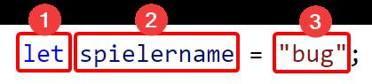

# Wie man Variablen initialisiert
Die Initialisierung von Variablen folgt immer dem selben Muster:

1. Gibt die **Art der Deklaration** an. `let` steht für eine **Variable**, andere Arten lernst du in der nächsten Aufgabe kennen.
2. Gibt den **Namen der Variable** an. Im Beispiel also *spielername*.
3. Gibt den **Wert der Variable** an. Im Beispiel ist dieser der String *"bug"*. Dass es ein String ist, sieht man an den Anführungszeichen. Der Wert kann ganz unterschiedlich sein und beispielsweise vom Typ String (Text), Number (Zahl) oder Boolean (Wahrheitswert).

Wichtig ist, dass zwischen dem **Namen der Variable** und dem **Wert der Variable** ein **Gleichheitszeichen (=)** steht.

Abgeschlossen wird eine solche Initialisierung am besten immer mit einem **Semikolon (;)**.