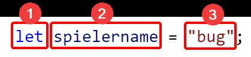

# Konstanten anlegen
Vom Aufbau her sind Konstanten genauso wie Variablen zu verwenden. Zur Erinnerung hier noch einmal der Aufbau der Initialisierung einer Variable:



1. Gibt die **Art der Deklaration** an. Dabei steht `let` für eine **Variable**. Da wir keine Variable sondern eine **Konstante** benötigen, ersetzen wir `let` durch `const` und bekommen damit eine Konstante.
2. Gibt den **Namen der Variable bzw. der Konstante** an. 
3. Gibt den **Wert der Variable bzw. der Konstante** an. 

Hier ein konkretes Beispiel:

```js
const lichtgeschwindigkeit = 299792458;
```