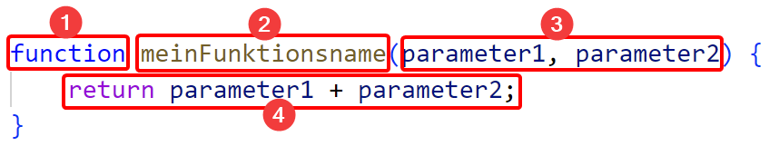

# Funktionsparameter
Parameter einer Funktion sind Werte, die man beim Aufruf der Funktion übergibt und die anschließend innerhalb der Funktion verwendet werden können. Parameter haben eindeutige Namen und können in der Funktion wie Variablen verwendet werden.

Aus der letzten Aufgabe sollte der grundlegende Aufbau von Funktionen bereits bekannt sein:



In diesem Beispiel hat die Funktion `meinFunktionsname` **zwei Parameter** mit den Namen `parameter1` und `parameter2`. Die Parameter werden durch **Kommas getrennt**. Diese Namen werden wie Variablen im Anweisungsblock der Funktion verwendet. Dort werden die Werte diese beiden Parameter addiert und anschließend von der Funktion zurückgegeben.

Ruft man diese Funktion auf, muss man Werte für die Parameter übergeben. Die Reihenfolge der Werte entspricht der Reihenfolge der angegebenen Parameter. 

```js
let ergebnis = meinFunktionsname(10, 20);
```

In diesem Beispielaufruf wäre `parameter1 = 10` und `parameter2 = 20`. 

**Wichtig**: Achte darauf, dass du für alle Parameter einen Wert übergibst, wird kein Wert übergeben, ist der Parameter `undefined`, was zu Problemen im Anweisungsblock der Funktion führt. 

**Auch wichtig**: In JavaScript kann man für jeden Parameter einen Wert von beliebigem Dateityp übergeben, das kann aber zu ungewollten Ergebnissen führen. Probiere zum Beispiel einmal aus, was passiert wenn du statt `meinFunktionsname(10, 20)` folgendes aufrufst: `meinFunktionsname("Hallo", 20)`.

# TODO: Arbeitsblatt
Planen